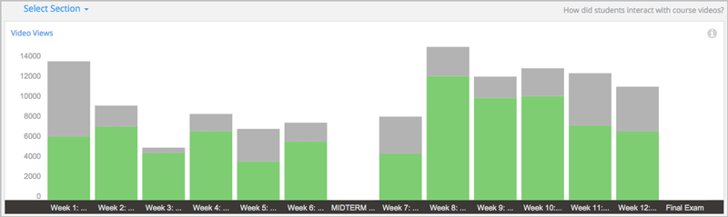
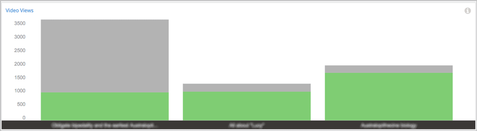
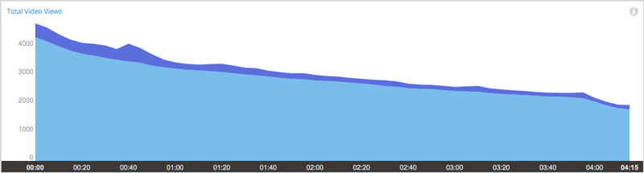
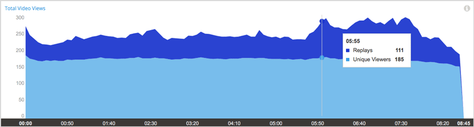

.. _Engagement_Video:

#############################
Engagement with Course Videos
#############################

Are learners watching the course videos? Do they watch some videos more than
others? Of those who watched a video, what percentage watched it to the end?
Do learners watch certain parts of the video more than once?

The video engagement data in edX Insights gives you perspective on your
learners' viewing patterns.

Video engagement data is updated every week for the period Monday at 00:00
UTC through Sunday at 23:59 UTC.

********************************************
Gaining Insight into Viewing Patterns
********************************************

EdX Insights delivers data about learner engagement with videos in a series of
charts and reports. Charts, metrics, and data are available for each of the
videos in your course. To access data about a specific video, you select the
section and subsection of the course that contain that video. When you make
these selections, edX Insights provides aggregated data about viewing patterns
for all videos in that part of the course outline.

For detailed information about the computations, see :ref:`Reference`.

*********************************************
Selecting the Section, Subsection, and Video
*********************************************

To access data about a video component, follow these steps.

#. Open edX Insights at insights.edx.org. A list of the courses for which you
   have the admin or staff role appears.

#. Select the course.

#. Select **How did students interact with course videos?**. Alternatively,
   select **Engagement** and then **Video**. A chart and a table of aggregated
   video data for the sections in your course appears. The chart only includes
   bars for sections that include at least one video component.

#. Select a section in your course that contains video components. A chart and
   a table of aggregated video data for each subsection in that section
   appears. The chart only includes bars for subsections that include
   at least one video component. 

#. Select a subsection. A chart and a table of aggregated video data for each
   unit in that subsection appears. The chart only includes bars for units
   that include at least one video component.

#. Select the unit that contains the video component. A chart, metrics, and a
   table of data for that video file appears.

For detailed information about the computations, see :ref:`Reference`.

*******************************************************
Analytics in Action: Interpreting Viewing Patterns
*******************************************************

A review of what learners in your course watch can lead to discoveries
about your videos and about your course.

* You can determine how many learners watch each video.

* You can determine how many learners watch the entire video, and where the
  other learners drop out.

* You can find video segments that learners watched more than once.

You can use this information to guide research on your video files and assess
where you might make changes.

=======================================================
Investigating Video Views for Sections and Subsections
=======================================================

To access data about a video, you select the section and subsection that
contain the video. When you make each of these selections, edX Insights
provides aggregated data of complete and incomplete video views.

In this chart of video views for the sections in a completed course, each bar
represents the number of views of all videos in a section. Each of the bars is
divided into the number of completed views in green and the number of
incomplete views in gray.

Reviewing the aggregated data in this chart might lead you to investigate
several questions. You might want to understand why there are so many more
incomplete views in some of the sections than in others. Does your course have
numerous short videos in most of the sections, and fewer, comparatively long
videos in one or two of the other sections? Is there a difference in quality?
Could you have, accidentally or deliberately, included the same video file in
your course more than once?

When you select a section with a relatively low number of complete views,
another stacked bar chart displays for the subsections in that section. 

  than a third of the students who started videos finished watching them.

This chart helps you focus your investigation on the first subsection, in
which more than twice as many learners begin to view a video than complete the
viewing. After you select that subsection, the chart for video views in the
units appears. Once again, the aggregate data can help guide your
investigation into the disproportionate number of incomplete video views.

================================
Researching Replayed Segments
================================

When you review the chart for a video, you can see which five second segments
learners played more than once. The stacked area graph shows replays in darker
blue above plays by unique users.

When you see the graph for this video, you decide to investigate what exactly
happens at the 40 second mark.

  seconds in to the video.

.. https://stage-insights.edx.org/courses/BerkeleyX/ColWri.2.2x/1T2015/engagement/videos/sections/i4x%3A//BerkeleyX/ColWri.2.2x/chapter/42e28dbf0b81488887be0f92a44484c9/subsections/i4x%3A//BerkeleyX/ColWri.2.2x/sequential/19a7ac548119487181e1f466cf48444c/modules/i4x%3A//BerkeleyX/ColWri.2.2x/video/ebe6682c6c3f424c9e59fff972ac19a4/timeline/

To find out what that segment of the video contains, you select **View Live**
to open the LMS to the unit that contains that video. In this example, a
single word is difficult to understand. Because the transcript for the video
is accurate, you might decide that no action is needed in this case.

In another video, the stacked area graph shows that learners replayed certain
segments of the video, particularly near the end, more often than others.

     the last three minutes of the video.

.. https://stage-insights.edx.org/courses/course-v1%3ACaltechX%2BEc1011x_2%2BT12015/engagement/videos/sections/block-v1%3ACaltechX%2BEc1011x_2%2BT12015%2Btype%40chapter%2Bblock%40d9e39345ddf744dd901cc9b290b72854/subsections/block-v1%3ACaltechX%2BEc1011x_2%2BT12015%2Btype%40sequential%2Bblock%40228af3c5dd49458393b568c52777618e/modules/block-v1%3ACaltechX%2BEc1011x_2%2BT12015%2Btype%40video%2Bblock%40aad61465c75f43d1ba5c8c8acb25a054/timeline/

After you review the video in the LMS, you might decide that the increased
number of replays was an indicator of the complexity of the material being
covered. You might decide to spend some extra time answering questions in the
discussion topic for that unit, or provide a course handout with additional
references on the material covered for learners who want them.

==========================================
Establishing an Engagement Baseline
==========================================

Week 1 of your course begins with a videotaped lecture that is about an hour
long. About two weeks after the course start date you use the video metrics
available in edX Insights to find that over 35,000 learners started playing
the video, and that almost 18,000 learners completed it.

You decide that this count of 18,000 will be more meaningful as a baseline of
committed learners than the overall course enrollment count. As your course
progresses, you use the number of learners who completed the first video as
the basis for evaluating how many learners continue to engage with course
content.